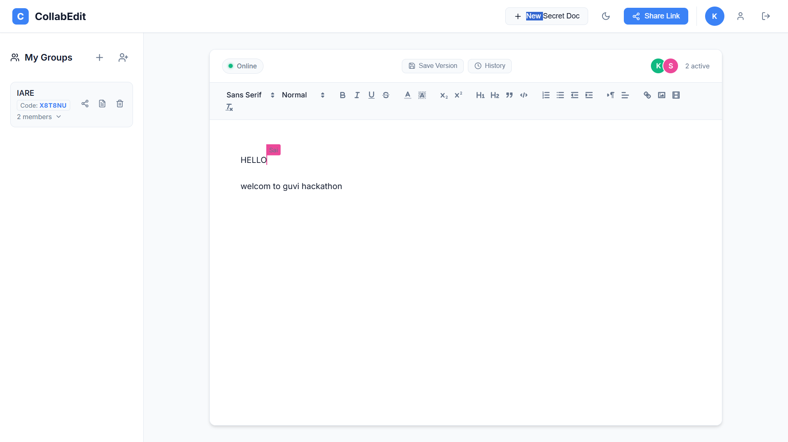
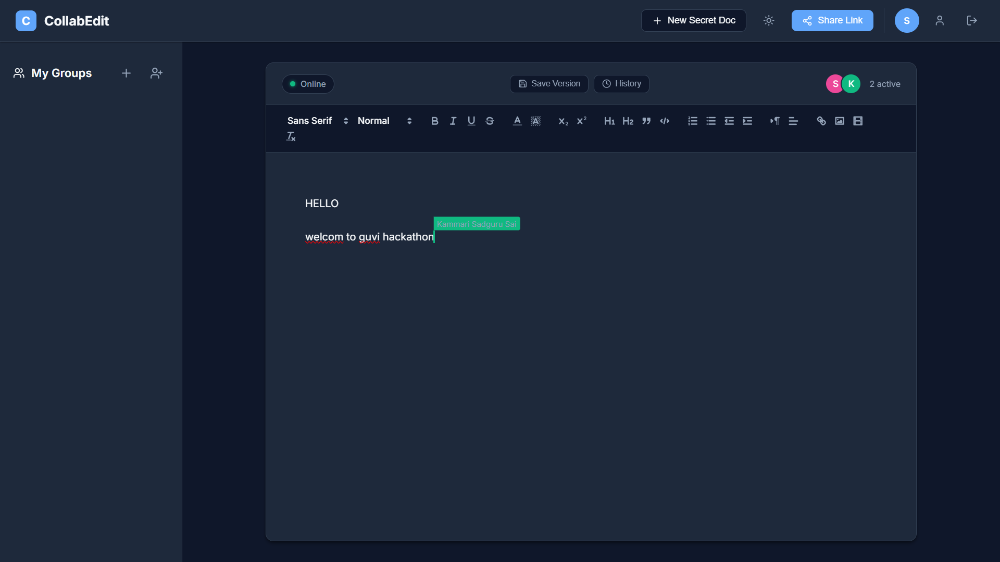
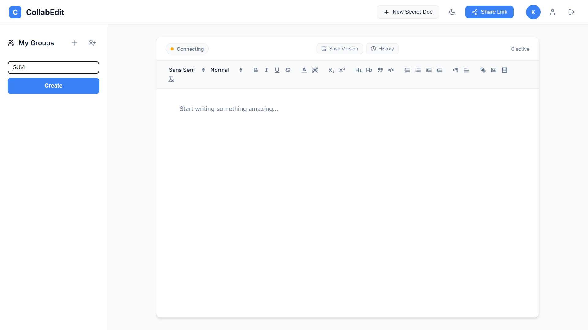
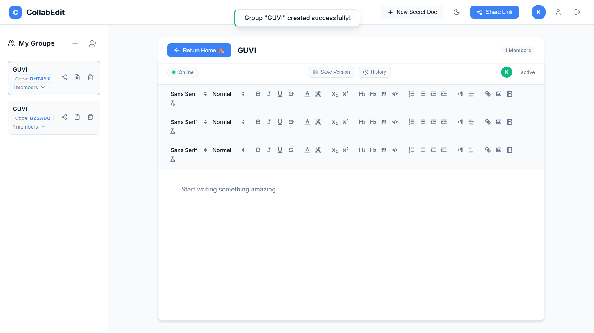
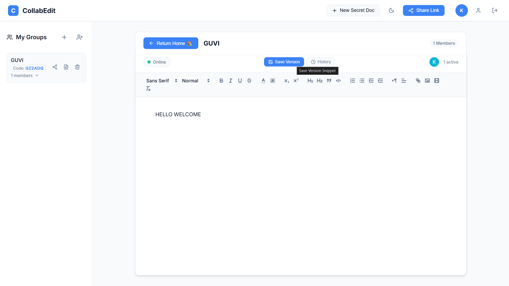
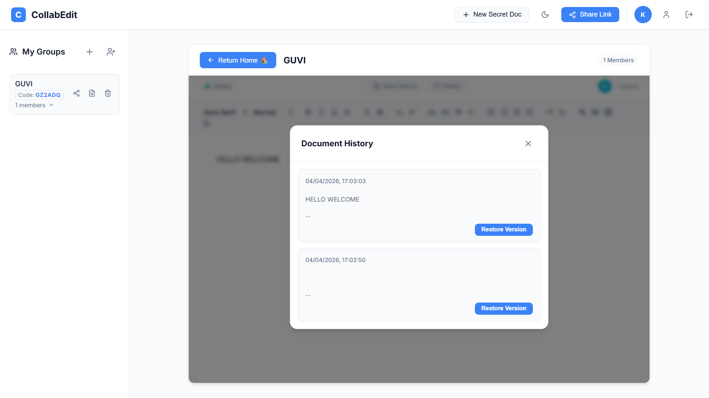
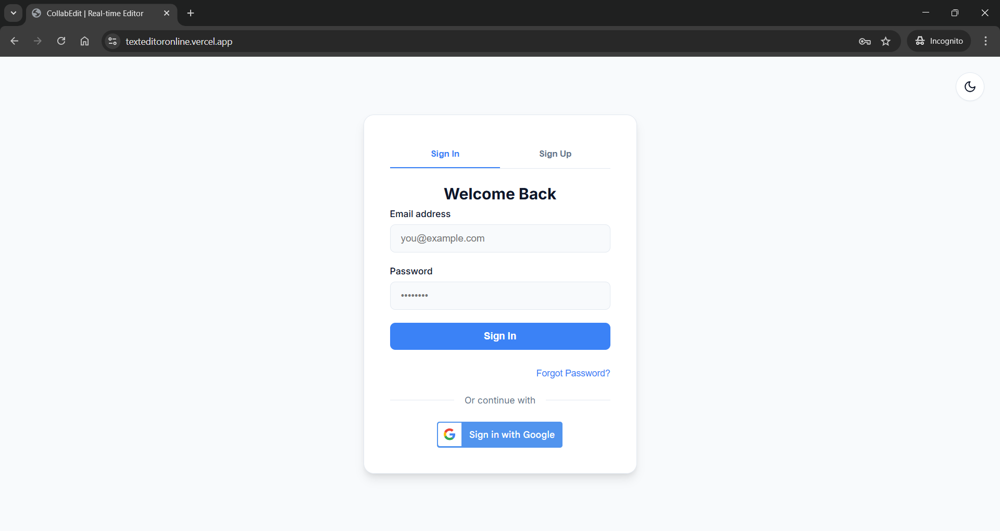
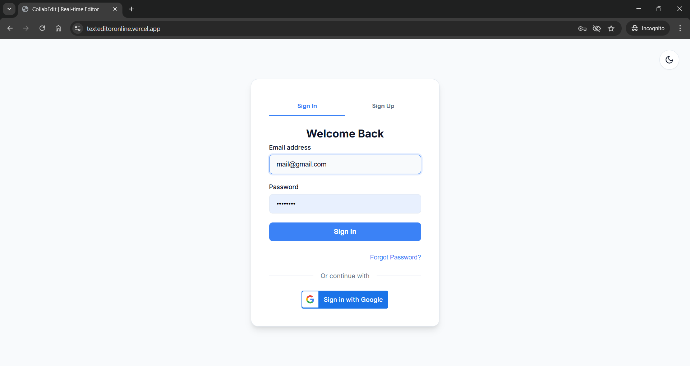
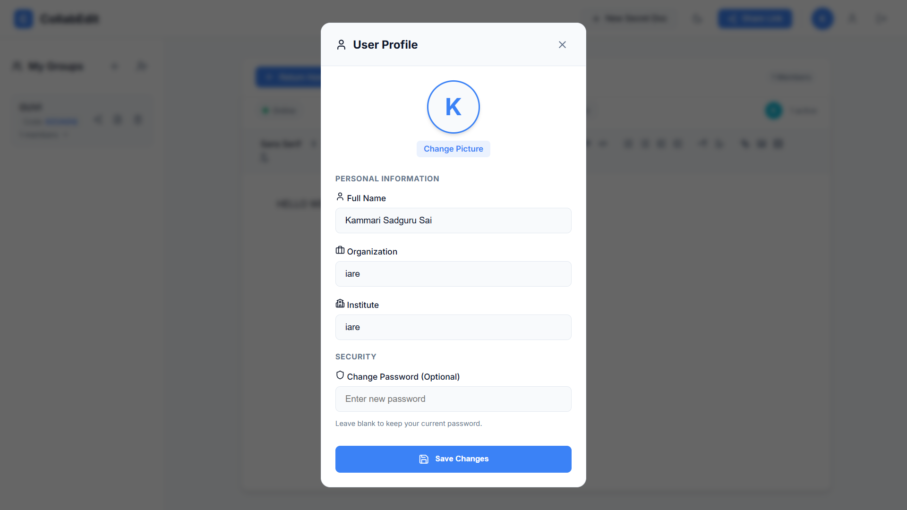
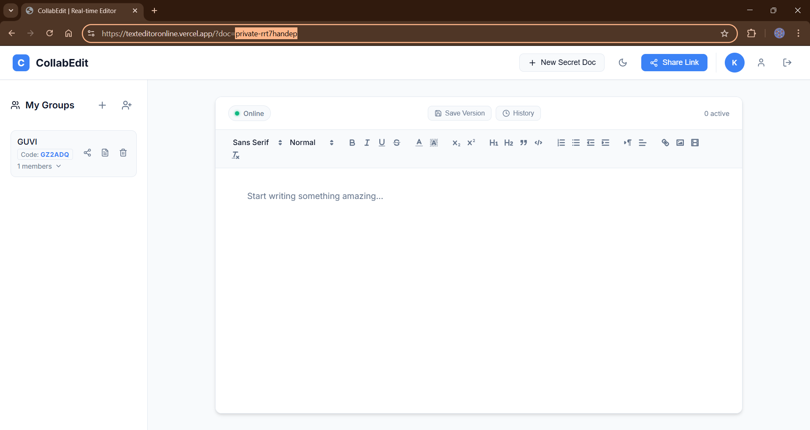

# CollabEdit — Real-Time Collaborative Editor

> A production-ready, real-time collaborative text editor with group management, document persistence, revision history, and secure Google/email authentication.


---

## 🖥️ Live Demo

- **Frontend (Vercel):** [https://your-app.vercel.app](https://your-app.vercel.app)
- **Backend (Render):** [https://your-backend.onrender.com](https://your-backend.onrender.com)

---

## 📋 Table of Contents

1. [Features](#features)
2. [Tech Stack](#tech-stack)
3. [Architecture Overview](#architecture-overview)
4. [Setup Instructions](#setup-instructions)
5. [Environment Variables](#environment-variables)
6. [Database Schema](#database-schema)
7. [API Reference](#api-reference)
8. [AI Tools Used](#ai-tools-used)
9. [Known Limitations](#known-limitations)

---

## ✨ Features

### 🖊️ Real-time Collaboration
Multiple users edit the same document simultaneously with live cursors showing each other's position and name in real time.




---

### 👥 Group Management
Create invite-code-based private groups, join via a 6-character code, see full member lists with admin/member role badges, and delete groups as an admin.




---

### 💾 Document Persistence
All document state is persisted in Supabase PostgreSQL so your work is never lost, even after a server restart or browser close.



---

### 🕐 Revision History
Save named document snapshots at any point and restore any prior version with a single click.



---

### 🔐 Google OAuth Login
One-click sign-in via Google with automatic account deduplication — no duplicate accounts created on repeated logins.



---

### 📧 Email / Password Auth
Traditional signup/login with email, plus secure password reset via an emailed Supabase recovery link and CAPTCHA verification.



---

### 👤 Profile Management
Update your display name, organization, and institute. Upload a custom avatar photo stored securely in Supabase Storage.



---

### 🔗 Private Secret Documents
Generate a unique secret document URL shareable only with people you choose — no login needed to collaborate on it.



---


### 🌗 Dark / Light Theme
Full dark and light theme toggle with automatic persistence in `localStorage` — your preference is remembered across sessions.


---


## 🛠️ Tech Stack

### Frontend
| Technology | Purpose |
|---|---|
| **React 18** | UI framework with hooks for state and effect management |
| **Vite** | Lightning-fast dev server and production bundler |
| **Yjs** | CRDT (Conflict-free Replicated Data Type) engine for real-time sync |
| **y-websocket** | Yjs WebSocket provider for broadcasting document state |
| **Quill** | Rich text editor embedded inside React |
| **y-quill** | Yjs binding for Quill, enabling real-time collaboration |
| **quill-cursors** | Displays live cursor positions of other collaborators |
| **@react-oauth/google** | Google OAuth 2.0 login integration |
| **jwt-decode** | Decodes Google JWTs on the client side |
| **react-simple-captcha** | CAPTCHA challenge on password reset form |
| **axios** | HTTP client for REST API calls to the backend |
| **lucide-react** | Modern icon library for all UI icons |
| **Vanilla CSS** | Custom design system with CSS variables for theming |

### Backend
| Technology | Purpose |
|---|---|
| **Node.js + Express** | REST API server and WebSocket upgrade handler |
| **y-websocket** (`setupWSConnection`) | Yjs WebSocket server for collaborative sync |
| **Supabase** | PostgreSQL database, Auth, and File Storage |
| **@supabase/supabase-js** | Supabase client SDK for Node.js |
| **google-auth-library** | Verifies Google OAuth tokens on the server |
| **express-fileupload** | Handles multipart form-data for avatar uploads |
| **helmet** | HTTP security headers middleware |
| **express-rate-limit** | Rate limiting to protect API endpoints |
| **cors** | Cross-origin request handling |
| **dotenv** | Environment variable loader |

### Infrastructure
| Service | Purpose |
|---|---|
| **Vercel** | Frontend deployment with automatic CI/CD |
| **Render** | Backend Node.js + WebSocket server hosting |
| **Supabase** | Managed PostgreSQL + Auth + Storage |
| **GitHub** | Source code repository and CI/CD trigger |

---

## 🏗️ Architecture Overview

```
┌──────────────────────────────────────────────────────┐
│                    BROWSER (Vercel)                   │
│                                                      │
│  ┌────────────┐    ┌──────────────┐   ┌───────────┐ │
│  │  Login /   │    │   Groups     │   │  Editor   │ │
│  │  Profile   │    │   Sidebar    │   │  (Quill)  │ │
│  └──────┬─────┘    └──────┬───────┘   └─────┬─────┘ │
│         │                 │                 │        │
│         └────── axios ────┘           Yjs + y-ws    │
└──────────────────┬──────────────────────────┼────────┘
                   │ REST (HTTPS)              │ WebSocket (WSS)
┌──────────────────▼───────────────────────────▼────────┐
│                  BACKEND (Render)                      │
│                                                       │
│  ┌────────────────────┐    ┌─────────────────────┐   │
│  │  Express REST API  │    │  y-websocket Server  │   │
│  │  /auth /groups     │    │  Real-time CRDT sync │   │
│  │  /revisions etc.   │    │  + Supabase persist  │   │
│  └─────────┬──────────┘    └──────────┬───────────┘   │
└────────────┼─────────────────────────┼───────────────┘
             │                         │
┌────────────▼─────────────────────────▼───────────────┐
│                    SUPABASE                           │
│                                                      │
│  ┌──────────┐  ┌──────────┐  ┌──────────────────┐   │
│  │   Auth   │  │ Postgres │  │  Storage (avatars)│   │
│  │ (Users)  │  │  Tables  │  │                  │   │
│  └──────────┘  └──────────┘  └──────────────────┘   │
└──────────────────────────────────────────────────────┘
```

### Data Flow for Real-Time Collaboration
1. User opens a document URL — the **Editor** component connects to the backend via **WebSocket**.
2. **Yjs** creates a local CRDT document. The **y-websocket provider** syncs changes with all other connected clients.
3. On the server, every `update` event saves the encoded Yjs state to Supabase's `documents` table (as hexadecimal binary).
4. When a new user connects to an existing document, the server loads the stored state from Supabase and applies it to the Yjs document — full persistence achieved.

---

## 🚀 Setup Instructions

### Prerequisites
- **Node.js** v18+
- **npm** v9+
- A **Supabase** project (free tier works)
- A **Google Cloud** project with OAuth 2.0 credentials

### 1. Clone the Repository

```bash
git clone https://github.com/your-username/collaborative-editor.git
cd collaborative-editor
```

### 2. Set Up the Backend

```bash
cd server
npm install
```

Create a `.env` file inside `server/`:

```env
SUPABASE_URL=https://your-project.supabase.co
SUPABASE_SERVICE_ROLE_KEY=your-service-role-key
CLIENT_URL=http://localhost:5173
VITE_GOOGLE_CLIENT_ID=your-google-client-id.apps.googleusercontent.com
PORT=5000
```

Start the backend:
```bash
node index.js
```

### 3. Set Up the Frontend

```bash
cd ../client
npm install
```

Create a `.env` file inside `client/`:

```env
VITE_API_BASE=http://localhost:5000
VITE_WS_URL=ws://localhost:5000
VITE_GOOGLE_CLIENT_ID=your-google-client-id.apps.googleusercontent.com
```

Start the frontend:
```bash
npm run dev
```

Open **http://localhost:5173** in your browser.

### 4. Set Up the Database (Supabase SQL Editor)

Run the following SQL in your Supabase project's **SQL Editor**:

```sql
-- Documents persistence table (stores Yjs binary state)
CREATE TABLE documents (
  name text PRIMARY KEY,
  data text,
  updated_at timestamptz DEFAULT now()
);

-- Groups table
CREATE TABLE groups (
  id uuid DEFAULT gen_random_uuid() PRIMARY KEY,
  name text NOT NULL,
  owner_id text NOT NULL,
  invite_code text UNIQUE,
  members jsonb DEFAULT '[]'::jsonb,
  created_at timestamptz DEFAULT now()
);

-- Revision History table
CREATE TABLE revisions (
  id uuid DEFAULT gen_random_uuid() PRIMARY KEY,
  doc_id text NOT NULL,
  user_id text,
  content text NOT NULL,
  created_at timestamptz DEFAULT now()
);

CREATE INDEX ON revisions (doc_id);

-- Avatar storage bucket (run in Supabase Storage UI or SQL)
INSERT INTO storage.buckets (id, name, public) VALUES ('avatars', 'avatars', true);
```

### 5. Configure Google OAuth

1. Go to [Google Cloud Console](https://console.cloud.google.com) → APIs & Services → Credentials.
2. Create an **OAuth 2.0 Client ID** (Web Application).
3. Add authorized origins: `http://localhost:5173` (dev), your Vercel URL (prod).
4. Add authorized redirect URIs if needed by Supabase Auth.
5. Copy the **Client ID** and add it to both `.env` files.

---

## 🌍 Environment Variables

### Client (`client/.env`)
| Variable | Description |
|---|---|
| `VITE_API_BASE` | Full URL of the backend REST API |
| `VITE_WS_URL` | Full URL of the backend WebSocket server |
| `VITE_GOOGLE_CLIENT_ID` | Google OAuth 2.0 Client ID |

### Server (`server/.env`)
| Variable | Description |
|---|---|
| `SUPABASE_URL` | Supabase project URL |
| `SUPABASE_SERVICE_ROLE_KEY` | Supabase service role key (admin access) |
| `CLIENT_URL` | Frontend URL for CORS and password reset redirects |
| `VITE_GOOGLE_CLIENT_ID` | Google OAuth 2.0 Client ID for server-side verification |
| `PORT` | Port the backend listens on (default: 5000) |

---

## 🗄️ Database Schema

### `documents`
| Column | Type | Description |
|---|---|---|
| `name` | text (PK) | Document identifier (e.g. `shared-document`, `group-abc123`) |
| `data` | text | Yjs state as a hex-encoded binary string |
| `updated_at` | timestamptz | Timestamp of last update |

### `groups`
| Column | Type | Description |
|---|---|---|
| `id` | uuid (PK) | Auto-generated group ID |
| `name` | text | Group display name |
| `owner_id` | text | Supabase user ID of the group creator |
| `invite_code` | text (unique) | 6-character alphanumeric invite code |
| `members` | jsonb | Array of member user IDs |
| `created_at` | timestamptz | Timestamp of creation |

### `revisions`
| Column | Type | Description |
|---|---|---|
| `id` | uuid (PK) | Auto-generated revision ID |
| `doc_id` | text | Document name/identifier this revision belongs to |
| `user_id` | text | User who saved the revision |
| `content` | text | Full HTML snapshot of the document at save time |
| `created_at` | timestamptz | Timestamp of save |

---

## 📡 API Reference

### Auth
| Method | Endpoint | Description |
|---|---|---|
| `POST` | `/register` | Create a new email/password account |
| `POST` | `/login` | Sign in with email and password |
| `POST` | `/auth/google` | Sign in or register via Google OAuth token |
| `POST` | `/forgot-password` | Send a Supabase password reset email |
| `POST` | `/update-password` | Update password using a recovery token |
| `PUT` | `/profile` | Update user profile (name, org, institute) |
| `POST` | `/upload-avatar` | Upload and store profile avatar image |

### Groups
| Method | Endpoint | Description |
|---|---|---|
| `GET` | `/groups/:userId` | List all groups the user owns or has joined |
| `POST` | `/groups` | Create a new group |
| `POST` | `/groups/join` | Join a group using an invite code |
| `DELETE` | `/groups/:id` | Delete a group (owner only) |

### Revisions
| Method | Endpoint | Description |
|---|---|---|
| `POST` | `/revisions` | Save a new document revision snapshot |
| `GET` | `/revisions/:docId` | Retrieve the last 20 revisions for a document |

---

## 🤖 AI Tools Used

This project was developed with AI-assisted coding throughout the entire development lifecycle:

| AI Tool | Role & Usage |
|---|---|
| **Antigravity (Google DeepMind)** | Primary AI coding assistant used for the entire project. Responsible for architecture design, writing all React components (`App.jsx`, `Editor.jsx`, `Groups.jsx`, `Profile.jsx`, `Login.jsx`), implementing the Node.js/Express backend (`server/index.js`), all CSS styling and theming, debugging complex issues (YJS binding, Supabase persistence, WebSocket upgrades), and iterative feature development based on user feedback. |
| **Gemini (Google DeepMind)** | Underlying language model powering the Antigravity assistant. Used for code generation, bug analysis, architecture reasoning, and documentation writing. |

> **Note:** All code was AI-generated iteratively in response to user requirements and tested/refined in real-time. The AI assistant handled the complete development cycle from initial scaffolding to production deployment configuration.

---

## ⚠️ Known Limitations

### Real-Time Sync
- **In-memory by default:** The y-websocket server stores documents in memory. If the Render server restarts, the in-memory Yjs state is lost but the **Supabase-persisted** hex state is reloaded on the next connection.
- **No conflict-free guarantees on restore:** Restoring a revision overwrites the live Quill editor content via `dangerouslyPasteHTML`, which replaces rather than merges concurrent edits.

### Authentication
- **No JWT session refresh:** The user's session is stored in `localStorage` indefinitely. There is no automatic token refresh — users need to re-login after Supabase session expiry.
- **Google OAuth requires HTTPS in production:** The Google Sign-In button will not work on non-HTTPS origins.

### Groups
- **No real-time member updates:** The member list in the sidebar refreshes only on page load or group action. If another user joins, you need to refresh to see them.
- **No leave group feature:** Non-owner members cannot leave a group. This must be done by the admin deleting and recreating the group, or via a database edit.

### Document Persistence
- **Hex encoding overhead:** Document state is stored as a hex string in PostgreSQL. For very large documents (100,000+ words), storage and retrieval may become slower.
- **No auto-save revision:** Revisions must be saved manually using the "Save Version" button. There is no autosave interval.

### Scalability
- **Single server:** The WebSocket server is a single Node.js process on Render. There is no horizontal scaling or Redis-backed synchronization for multi-instance deployments.
- **Render free tier cold starts:** The backend on Render's free tier may take 30–60 seconds to wake up after inactivity, causing an initial connection delay.

### Security
- **No row-level security (RLS):** Supabase RLS policies are not enabled. The service role key is used on the backend, which means all access is managed at the application level, not the database level.

---

## 📁 Project Structure

```
collaborative-editor/
├── client/                    # React frontend (Vite)
│   ├── src/
│   │   ├── App.jsx            # Root app, routing, theme, notifications
│   │   ├── App.css            # Global layout and component styles
│   │   ├── Editor.jsx         # Quill + Yjs real-time editor component
│   │   ├── Editor.css         # Editor-specific styles + revision modal
│   │   ├── Groups.jsx         # Group management sidebar
│   │   ├── Groups.css         # Groups sidebar styles
│   │   ├── Login.jsx          # Auth forms (login/signup/reset)
│   │   ├── Login.css          # Login page styles
│   │   ├── Profile.jsx        # Profile edit modal
│   │   ├── Profile.css        # Profile modal styles
│   │   └── index.css          # Global resets, CSS variables, scrollbars
│   ├── .env                   # Frontend environment variables
│   └── vite.config.js         # Vite configuration
│
├── server/                    # Node.js + Express backend
│   ├── index.js               # All routes + WebSocket server
│   └── .env                   # Backend environment variables
│
└── README.md                  # This file
```

---

## 📜 License

This project is licensed under the **MIT License** — feel free to use, modify and distribute.

---

## 👨‍💻 Author

Built with ❤️ for **GUVI Hackathon 2026** using AI-assisted development.
